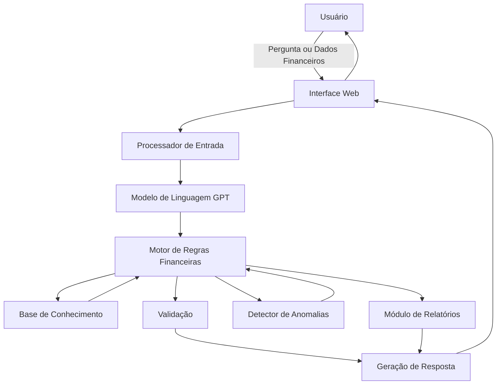

# Documentação do Agente

## Caso de Uso

### Problema

> Qual problema financeiro seu agente resolve?

Muitas pessoas possuem dificuldade para controlar suas finanças pessoais, identificar gastos excessivos, planejar metas financeiras e entender sua situação financeira atual. Além disso, a análise manual de despesas e receitas pode consumir tempo e gerar erros, dificultando a tomada de decisões financeiras conscientes.

O agente resolve problemas relacionados a:

* Controle de receitas e despesas.
* Identificação de gastos desnecessários.
* Organização do orçamento mensal.
* Monitoramento de metas financeiras.
* Análise de padrões de consumo.
* Geração de relatórios financeiros simplificados.
* Alertas de possíveis problemas financeiros, como gastos acima da média ou saldo insuficiente.

### Solução

> Como o agente resolve esse problema de forma proativa?

O agente atua como um assistente financeiro virtual que monitora continuamente os dados financeiros do usuário.

Funcionalidades:

* Classificação automática de receitas e despesas.
* Cálculo de saldo disponível.
* Análise de tendências de gastos.
* Detecção de anomalias financeiras.
* Sugestão de economia baseada no histórico do usuário.
* Geração de relatórios periódicos.
* Alertas preventivos sobre possíveis riscos financeiros.
* Acompanhamento de metas de poupança.
* Respostas inteligentes para dúvidas financeiras básicas.

O agente utiliza Inteligência Artificial para interpretar os dados financeiros e fornecer recomendações personalizadas, ajudando o usuário a tomar decisões mais informadas.

### Público-Alvo

> Quem vai usar esse agente?

**Pessoas físicas**

* Trabalhadores CLT.
* Autônomos.
* Profissionais liberais.
* Estudantes.

**Pequenos empreendedores**

* Microempreendedores Individuais (MEI).
* Pequenas empresas.
* Prestadores de serviços.

**Instituições**

* Cooperativas financeiras.
* Fintechs.
* Empresas interessadas em educação financeira para colaboradores.

---

# Persona e Tom de Voz

### Nome do Agente

**FinSmart AI**

### Personalidade

> Como o agente se comporta?

O agente possui perfil:

* Consultivo.
* Educativo.
* Analítico.
* Proativo.
* Empático.
* Orientado a resultados.

Seu objetivo é ajudar o usuário a compreender sua situação financeira sem julgamentos, oferecendo orientações claras e práticas.

### Tom de Comunicação

> Formal, informal, técnico, acessível?

O tom é:

* Profissional.
* Claro.
* Objetivo.
* Acessível para usuários sem conhecimento financeiro.
* Técnico apenas quando necessário.
* Didático ao explicar conceitos financeiros.

### Exemplos de Linguagem

**Saudação**

> "Olá! Sou o FinSmart AI. Estou aqui para ajudar você a entender melhor suas finanças e alcançar seus objetivos financeiros."

**Confirmação**

> "Entendi sua solicitação. Vou analisar suas informações financeiras e apresentar um resumo."

**Alerta**

> "Identifiquei um aumento de 35% nos gastos com alimentação em relação ao mês anterior."

**Sugestão**

> "Você pode economizar aproximadamente R$ 250 por mês reduzindo despesas recorrentes identificadas."

**Erro/Limitação**

> "Não encontrei informações suficientes para realizar essa análise. Poderia fornecer mais detalhes?"

---

# Arquitetura

### Diagrama

### Componentes

| Componente             | Descrição                                                |
| ---------------------- | -------------------------------------------------------- |
| Interface              | Aplicação Web em Streamlit ou Chatbot                    |
| Processador de Entrada | Trata perguntas e dados enviados pelo usuário            |
| LLM                    | GPT-4/GPT-5 via API                                      |
| Base de Conhecimento   | Banco de dados financeiro em CSV, JSON ou SQL            |
| Motor de Regras        | Regras de negócio para cálculos financeiros              |
| Detector de Anomalias  | Identifica transações suspeitas ou gastos fora do padrão |
| Validação              | Verifica consistência das respostas geradas              |
| Módulo de Relatórios   | Gera dashboards e relatórios financeiros                 |
| Logs                   | Registro de interações e auditoria                       |

---

# Segurança e Anti-Alucinação

### Estratégias Adotadas

* [x] O agente responde apenas utilizando dados financeiros disponíveis.
* [x] Todas as análises possuem rastreabilidade dos dados utilizados.
* [x] Informa claramente quando não possui informações suficientes.
* [x] Não realiza recomendações de investimentos sem perfil do investidor.
* [x] Validação de consistência antes de responder.
* [x] Limitação de escopo para educação financeira.
* [x] Registro de logs para auditoria.
* [x] Criptografia de dados sensíveis.
* [x] Controle de acesso por autenticação.
* [x] Mascaramento de informações pessoais.

### Mecanismos de Controle

1. Verificação de origem dos dados.
2. Regras financeiras pré-definidas.
3. Validação cruzada dos cálculos.
4. Bloqueio de respostas especulativas.
5. Classificação automática do nível de confiança da resposta.
6. Monitoramento de erros e feedback dos usuários.

---

# Limitações Declaradas

> O que o agente NÃO faz?

O agente NÃO:

* Aprova empréstimos.
* Realiza movimentações financeiras.
* Executa investimentos automaticamente.
* Substitui um contador ou consultor financeiro.
* Garante rentabilidade financeira.
* Faz previsões exatas de mercado.
* Fornece aconselhamento financeiro regulamentado.
* Acessa contas bancárias sem autorização explícita.
* Compartilha dados financeiros com terceiros.
* Toma decisões financeiras em nome do usuário.

### Aviso Importante

"As informações fornecidas pelo agente têm caráter educativo e informativo. As decisões financeiras são de responsabilidade exclusiva do usuário. Para orientações financeiras, tributárias ou jurídicas específicas, recomenda-se consultar um profissional habilitado."

---

### Diferencial do Projeto

**Detecção Inteligente de Anomalias Financeiras**

O agente utiliza algoritmos de Machine Learning para identificar:

* Compras atípicas.
* Gastos acima da média histórica.
* Possíveis fraudes.
* Cobranças duplicadas.
* Movimentações incomuns.
* Mudanças repentinas no comportamento financeiro.

Isso permite uma atuação preventiva, aumentando a segurança financeira do usuário e reduzindo riscos de perdas financeiras.
